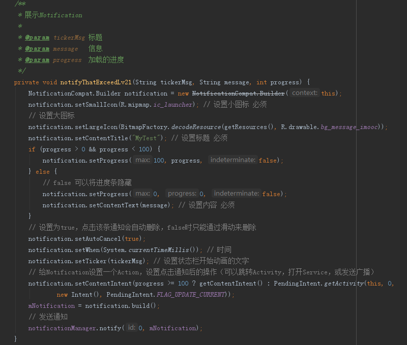
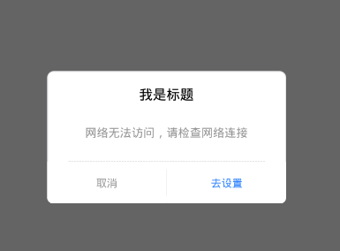
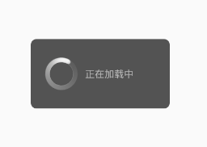

# MyDialog
Dialog Demo

## 加载布局封装
### 在网络请求的时候先展示加载界面，如果请求失败展示失败界面并点击可以再次加载
    public class LoadLayout extends FrameLayout {

        public LoadLayout(@NonNull Context context) {
            this(context, null);
        }

        public LoadLayout(@NonNull Context context, @Nullable AttributeSet attrs) {
            this(context, attrs, 0);
        }

        public LoadLayout(@NonNull Context context, @Nullable AttributeSet attrs, int defStyleAttr) {
            super(context, attrs, defStyleAttr);
            initView();
        }

        /**
         * 初始化View
         */
        private View loadingView;
        private View errorView;
        private View emptyView;

        private void initView() {
            // 1. 加载LoadingView
            loadingView = View.inflate(getContext(), R.layout.load_ing, null);
            addView(loadingView);
            // 2.添加加载失败的View
            errorView = View.inflate(getContext(), R.layout.load_error, null);
            addView(errorView);
            // 3.添加空白界面
            emptyView = View.inflate(getContext(), R.layout.load_enpty, null);
            addView(emptyView);
            // 一开始就隐藏所有的View
            //  hideAll();
        }

        /**
         * 全部都隐藏
         */
        public void hideAll() {
            // 设置各界面不可见，同时让它们不重新Layout
            loadingView.setVisibility(View.INVISIBLE);
            emptyView.setVisibility(INVISIBLE);
            errorView.setVisibility(INVISIBLE);
        }

        /**
         * 显示加载进度
         */
        public void showLoadingView() {
            hideAll();
            Log.d("jiejie","----show");
            loadingView.setVisibility(VISIBLE);
        }

        /**
         * 显示数据为空的界面
         */
        public void showEmptyView() {
            hideAll();
            emptyView.setVisibility(VISIBLE);
        }

        /**
         * 显示错误的界面
         */
        public void showErrorView() {
            hideAll();
            errorView.setVisibility(VISIBLE);
        }

        /**
         * 对错误页面进行点击
         */
        public void setErrorListener(View.OnClickListener listener) {
            if (listener != null && errorView != null) {
                hideAll();
                errorView.setOnClickListener(listener);
            }
        }
    }

### 版本跟新时，开启服务在状态栏中展示更新进度

### 自定义弹窗

    
     

### Apps 别人写的一个MVP demo